# ROICORE — OOAD (Object-Oriented Analysis & Design) — FULL PLAN

> **RO<span style="color:#2563eb;font-style:normal">i</span>CORE** — Flood Intelligence Platform
> เอกสารวิเคราะห์และออกแบบระบบแบบเต็มรูปแบบ (Full OOAD)
> Stack: OSM (แผนที่) · OpenWeather (สภาพอากาศ) · Supabase Local → Cloud
> UI: White Modern (No Border, No Shadow), Perfect Radius · หลักการ: OOP & OOAD

---

## สารบัญ

| บท | เนื้อหา |
|---|---|
| 0 | ขอบเขต & ความต้องการ (Scope & Requirements) |
| 1 | Use Case Model |
| 2 | Domain / Class Model |
| 3 | Sequence Diagrams |
| 4 | Activity Diagrams |
| 5 | State Machine Diagrams |
| 6 | Package & Component Architecture |
| 7 | Data Model (Supabase Schema) |
| 8 | Design Patterns Catalog |
| 9 | Module Breakdown & Class Inventory |
| 10 | Deployment Diagram |
| 11 | Non-Functional Requirements |
| 12 | Milestones & DoD |

---

## 0. ขอบเขต & ความต้องการ

### 0.1 วัตถุประสงค์ระบบ
ระบบแจ้งเตือนและตรวจเช็คสถานการณ์น้ำท่วมแบบเรียลไทม์ สำหรับ
1. **ผู้ประสบอุทกภัย (Flood Victim)** — รายงานจุดน้ำท่วมอย่างรวดเร็ว
2. **ผู้เดินทาง (Traveler)** — ตรวจเช็คจุดน้ำท่วมก่อนเดินทาง
3. **ผู้ดูแลระบบ (Admin)** — ยืนยัน/จัดการรายงาน คงความน่าเชื่อถือของข้อมูล

### 0.2 Actors

| Actor | คำอธิบาย | Auth |
|---|---|---|
| `FloodVictim` | ผู้ประสบอุทกภัย ต้องรายงานจุดน้ำท่วม | จำเป็น (Phone OTP) |
| `Traveler` | ผู้เดินทาง ต้องตรวจสอบเส้นทาง/จุดเสี่ยง | ไม่จำเป็น (Guest) |
| `Admin` | ผู้ดูแล ยืนยันและจัดการรายงาน | จำเป็น (Role: admin) |
| `<<system>> OpenWeather` | External — สภาพอากาศ & พยากรณ์ฝน | API Key |
| `<<system>> OpenStreetMap` | External — เบสแมพ & tile | ไม่มี key |
| `<<system>> Supabase` | External — Auth/DB/Realtime/Storage | Local/Cloud |
| `<<system>> Notification` | FCM/Push — แจ้งเตือนผู้ใช้ | — |

### 0.3 Functional Requirements

| ID | Requirement | Priority |
|---|---|---|
| FR-01 | ระบบต้องแสดงแผนที่ OSM พร้อมพินจุดน้ำท่วม | Must |
| FR-02 | ผู้ประสบอุทกภัยต้องส่งรายงานได้ภายใน ≤ 3 taps | Must |
| FR-03 | ระบบต้องยืนยันตัวตนด้วยเบอร์โทร (OTP) | Must |
| FR-04 | ระบบต้องดึงสภาพอากาศเรียลไทม์ต่อพื้นที่ | Must |
| FR-05 | จุดน้ำท่วมต้องอัปเดตแบบ Realtime | Must |
| FR-06 | ระบบต้องจัดระดับความเสี่ยง (Risk Level) อัตโนมัติ | Should |
| FR-07 | ผู้เดินทางต้องดูรายละเอียดจุดได้โดยไม่ต้อง login | Must |
| FR-08 | Admin ต้องยืนยัน/ปฏิเสธ/ปิดรายงานได้ | Should |
| FR-09 | ระบบต้องเก็บรูปหลักฐาน (photo evidence) | Should |
| FR-10 | ระบบต้องแจ้งเตือนผู้ใช้ในพื้นที่เสี่ยง | Could |

### 0.4 Non-Functional Requirements (สรุป — รายละเอียดบท 11)
- NFR-01 Performance: แผนที่โหลด < 2s, report submit < 3s
- NFR-02 Availability: 99.5%
- NFR-03 Security: OTP auth, RLS ทุกตาราง, ไม่เก็บ PIN/raw location นานเกินจำเป็น
- NFR-04 Scalability: Postgres + edge, รองรับ concurrent 1,000+
- NFR-05 Usability: White Modern UI, ไม่ใช้เส้นขอบ, radius คงที่, ภาษาไทย/อังกฤษ
- NFR-06 Offline-tolerant: cache แผนที่/จุดล่าสุดเมื่อสัญญาณไม่ดี

---

## 1. Use Case Model

### 1.1 Use Case Diagram — ภาพรวมทั้งระบบ

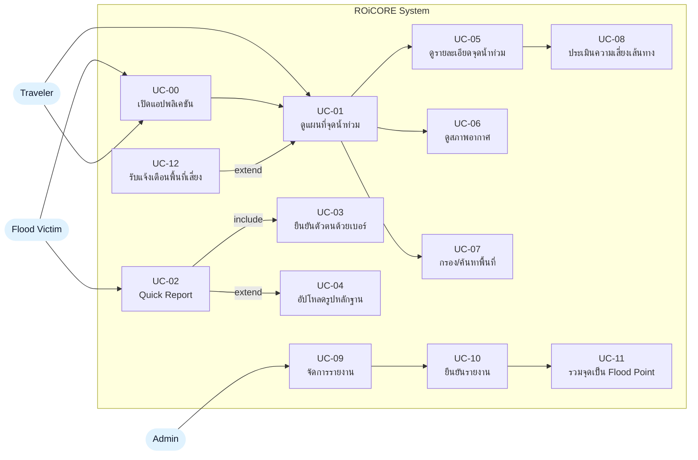
```mermaid
flowchart LR
    FV(["Flood Victim"])
    TV(["Traveler"])
    AD(["Admin"])

    subgraph SYS["ROiCORE System"]
        UC0["UC-00<br/>เปิดแอปพลิเคชัน"]
        UC1["UC-01<br/>ดูแผนที่จุดน้ำท่วม"]
        UC2["UC-02<br/>Quick Report"]
        UC3["UC-03<br/>ยืนยันตัวตนด้วยเบอร์"]
        UC4["UC-04<br/>อัปโหลดรูปหลักฐาน"]
        UC5["UC-05<br/>ดูรายละเอียดจุดน้ำท่วม"]
        UC6["UC-06<br/>ดูสภาพอากาศ"]
        UC7["UC-07<br/>กรอง/ค้นหาพื้นที่"]
        UC8["UC-08<br/>ประเมินความเสี่ยงเส้นทาง"]
        UC9["UC-09<br/>จัดการรายงาน"]
        UC10["UC-10<br/>ยืนยันรายงาน"]
        UC11["UC-11<br/>รวมจุดเป็น Flood Point"]
        UC12["UC-12<br/>รับแจ้งเตือนพื้นที่เสี่ยง"]
    end

    FV --> UC0
    FV --> UC2
    TV --> UC0
    TV --> UC1
    AD --> UC9

    UC0 --> UC1
    UC1 --> UC5
    UC1 --> UC6
    UC1 --> UC7
    UC5 --> UC8
    UC2 -->|"include"| UC3
    UC2 -->|"extend"| UC4
    UC9 --> UC10
    UC10 --> UC11
    UC12 -->|"extend"| UC1

    classDef actor fill:#E0F2FE,stroke:none,color:#0F172A
    class FV,TV,AD actor
```

### 1.2 Use Case Specifications

#### UC-02: Quick Report

| หัวข้อ | รายละเอียด |
|---|---|
| **Actor** | FloodVictim |
| **Precondition** | GPS เปิด, มีสัญญาณเน็ต (หรือ queue ไว้ส่งทีหลัง) |
| **Postcondition** | `flood_reports` record ถูกสร้าง, จุดปรากฏบนแผนที่ (realtime) |
| **Trigger** | ผู้ใช้กดปุ่ม "รายงานน้ำท่วม" (FAB) |

**Main Flow:**
1. ผู้ใช้เปิดแอป → geolocate ตำแหน่งปัจจุบัน
2. ผู้ใช้กด Quick Report → bottom sheet เปิด (radius-xl)
3. ระบบตรวจสอบ session → ถ้ายังไม่ยืนยัน ข้ามไป step 3.1
   - 3.1 ระบบแสดงช่องกรอกเบอร์โทร → ส่ง OTP
   - 3.2 ผู้ใช้กรอก OTP → ระบบ verify → สร้าง/ดึง `profiles`
4. ระบบแสดงฟอร์ม pre-fill: ตำแหน่ง (map pin), ระดับน้ำ (slider/chip), คำอธิบาย (optional)
5. ผู้ใช้กด "ส่งรายงาน"
6. ระบบ insert `flood_reports` (status=PENDING) + upload รูป (ถ้ามี)
7. ระบบแสดง Toast ยืนยันสำเร็จ

**Alternative Flows:**
- **4a** ผู้ใช้เลื่อนหมุดปรับตำแหน่ง → บันทึกพิกัดใหม่
- **6a OTP ผิด** → แจ้งเตือน ให้ลองใหม่ (เหลือโอกาส 3 ครั้ง)
- **6b Network ขาด** → รายงานถูก cache ในเครื่อง (outbox) และส่งอัตโนมัติเมื่อกลับมาออนไลน์
- **6c RLS/Auth fail** → แสดงข้อความ error + ปุ่ม retry

**Exception:** GPS ไม่พร้อม → อนุญาตให้เลือกอำเภอ/ตำบลจาก dropdown แทน

---

#### UC-01: ดูแผนที่จุดน้ำท่วม (Traveler/Guest)

| หัวข้อ | รายละเอียด |
|---|---|
| **Actor** | Traveler (guest ได้) |
| **Precondition** | เปิดแอปแล้ว |
| **Postcondition** | ผู้ใช้เห็นพินจุดเสี่ยง + สภาพอากาศของพื้นที่ |

**Main Flow:**
1. ผู้ใช้เปิดแอป → ระบบโหลด basemap OSM
2. ระบบ query `flood_points` (bounding box หน้าจอ) จาก Supabase
3. ระบบ subscribe realtime → อัปเดตพินเมื่อมีข้อมูลใหม่
4. ผู้ใช้เห็นพินสีตาม severity (blue/amber/red tint)
5. ผู้ใช้กดพิน → card แสดงรายละเอียด + weather จาก OpenWeather
6. (optional) ผู้ใช้กรองระดับความเสี่ยง / ค้นหาพื้นที่

**Alternative:**
- **2a** ไม่มีข้อมูล → แสดง empty state "ยังไม่มีรายงานในพื้นที่นี้"
- **2b** OpenWeather rate-limit → แสดงค่าล่าสุดจาก cache + badge "ข้อมูลล่าสุด"

---

#### UC-10/11: ยืนยันรายงาน & รวมเป็น Flood Point (Admin)

1. Admin เปิด queue รายงาน `status=PENDING`
2. กดดูรายละเอียด (รูป, เวลา, พิกัด ซ้อนบน OSM)
3. เลือก `VERIFY` → status=`VERIFIED`
4. ระบบ `FloodPointAggregator` หาจุดที่มีรายงานในรัศมี 200 m → upsert `flood_points`
5. จุดเปลี่ยนสี/เพิ่มบนแผนที่ → realtime broadcast → Traveler เห็นทันที

---

### 1.3 Use Case สรุปตาม Actor

| Actor | Use Cases |
|---|---|
| FloodVictim | UC-00 เปิดแอป · UC-02 Quick Report · UC-03 OTP · UC-04 รูป · UC-01 ดูแผนที่ |
| Traveler | UC-00 · UC-01 · UC-05 รายละเอียด · UC-06 weather · UC-07 กรอง · UC-08 route risk |
| Admin | UC-09 จัดการ · UC-10 ยืนยัน · UC-11 aggregate · UC-12 แจ้งเตือน |

---

## 2. Domain / Class Model

### 2.1 Class Diagram — Domain Core

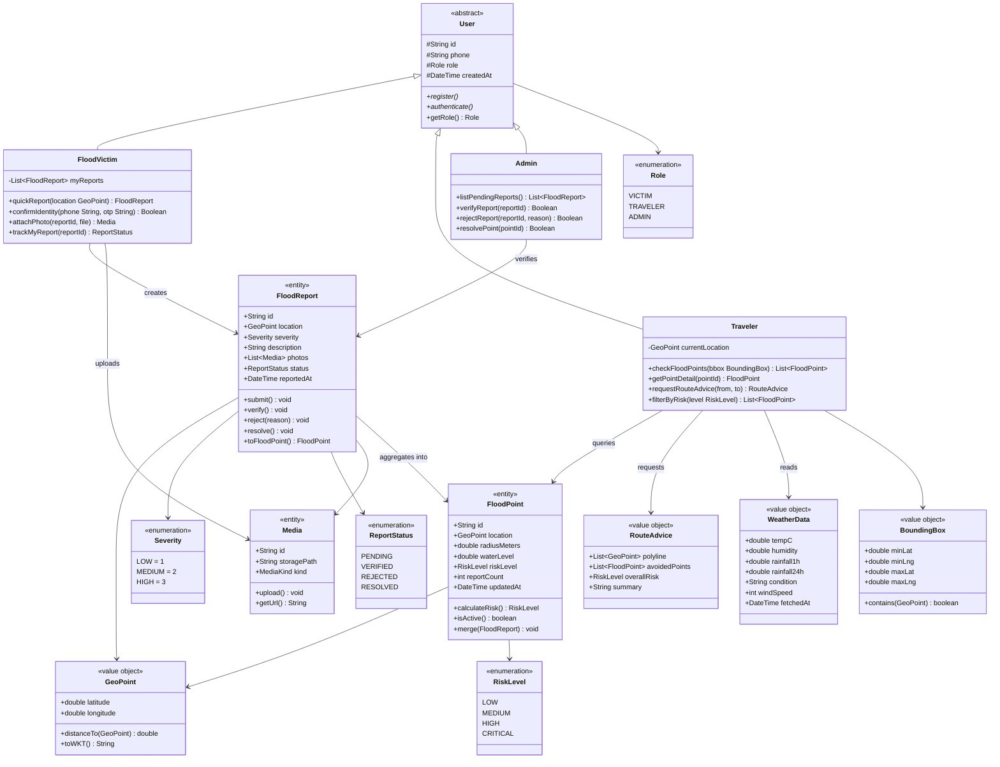
```mermaid
classDiagram
    direction TB

    class User {
        <<abstract>>
        #String id
        #String phone
        #Role role
        #DateTime createdAt
        +register()*
        +authenticate()*
        +getRole() Role
    }

    class Role {
        <<enumeration>>
        VICTIM
        TRAVELER
        ADMIN
    }

    class FloodVictim {
        -List~FloodReport~ myReports
        +quickReport(location GeoPoint) FloodReport
        +confirmIdentity(phone String, otp String) Boolean
        +attachPhoto(reportId, file) Media
        +trackMyReport(reportId) ReportStatus
    }

    class Traveler {
        -GeoPoint currentLocation
        +checkFloodPoints(bbox BoundingBox) List~FloodPoint~
        +getPointDetail(pointId) FloodPoint
        +requestRouteAdvice(from, to) RouteAdvice
        +filterByRisk(level RiskLevel) List~FloodPoint~
    }

    class Admin {
        +listPendingReports() List~FloodReport~
        +verifyReport(reportId) Boolean
        +rejectReport(reportId, reason) Boolean
        +resolvePoint(pointId) Boolean
    }

    class GeoPoint {
        <<value object>>
        +double latitude
        +double longitude
        +distanceTo(GeoPoint) double
        +toWKT() String
    }

    class BoundingBox {
        <<value object>>
        +double minLat
        +double minLng
        +double maxLat
        +double maxLng
        +contains(GeoPoint) boolean
    }

    class FloodReport {
        <<entity>>
        +String id
        +GeoPoint location
        +Severity severity
        +String description
        +List~Media~ photos
        +ReportStatus status
        +DateTime reportedAt
        +submit() void
        +verify() void
        +reject(reason) void
        +resolve() void
        +toFloodPoint() FloodPoint
    }

    class Severity {
        <<enumeration>>
        LOW = 1
        MEDIUM = 2
        HIGH = 3
    }

    class ReportStatus {
        <<enumeration>>
        PENDING
        VERIFIED
        REJECTED
        RESOLVED
    }

    class FloodPoint {
        <<entity>>
        +String id
        +GeoPoint location
        +double radiusMeters
        +double waterLevel
        +RiskLevel riskLevel
        +int reportCount
        +DateTime updatedAt
        +calculateRisk() RiskLevel
        +isActive() boolean
        +merge(FloodReport) void
    }

    class RiskLevel {
        <<enumeration>>
        LOW
        MEDIUM
        HIGH
        CRITICAL
    }

    class Media {
        <<entity>>
        +String id
        +String storagePath
        +MediaKind kind
        +upload() void
        +getUrl() String
    }

    class WeatherData {
        <<value object>>
        +double tempC
        +double humidity
        +double rainfall1h
        +double rainfall24h
        +String condition
        +int windSpeed
        +DateTime fetchedAt
    }

    class RouteAdvice {
        <<value object>>
        +List~GeoPoint~ polyline
        +List~FloodPoint~ avoidedPoints
        +RiskLevel overallRisk
        +String summary
    }

    User <|-- FloodVictim
    User <|-- Traveler
    User <|-- Admin
    User --> Role
    FloodVictim --> FloodReport : creates
    FloodVictim --> Media : uploads
    Traveler --> FloodPoint : queries
    Traveler --> RouteAdvice : requests
    Traveler --> WeatherData : reads
    Admin --> FloodReport : verifies
    FloodReport --> GeoPoint
    FloodReport --> Severity
    FloodReport --> ReportStatus
    FloodReport --> Media
    FloodReport --> FloodPoint : aggregates into
    FloodPoint --> GeoPoint
    FloodPoint --> RiskLevel
    Traveler --> BoundingBox
```

### 2.2 Class Diagram — Service / Data Layer (Ports & Adapters)


```mermaid
classDiagram
    direction TB

    class IWeatherService {
        <<interface>>
        +getCurrentWeather(GeoPoint) WeatherData
        +getForecast(GeoPoint, hours int) List~WeatherData~
        +getRainRisk(GeoPoint) double
    }

    class OpenWeatherService {
        -String apiKey
        -HttpClient http
        -ResponseCache cache
        +getCurrentWeather(GeoPoint) WeatherData
        +getForecast(GeoPoint, hours) List~WeatherData~
        +getRainRisk(GeoPoint) double
        -buildUrl(GeoPoint) String
        -mapResponse(json) WeatherData
    }

    class IMapService {
        <<interface>>
        +initMap(container, center) void
        +addMarker(GeoPoint, MarkerStyle) String
        +removeMarker(markerId) void
        +fitBounds(BoundingBox) void
        +onTap(callback) void
    }

    class OSMMapService {
        -MapAdapter map
        -TileLayer osmTiles
        +initMap(container, center) void
        +addMarker(GeoPoint, MarkerStyle) String
        +renderPoints(List~FloodPoint~) void
        +recenter(GeoPoint) void
    }

    class IRepository~T~ {
        <<interface>>
        +findById(id) T
        +query(spec QuerySpec) List~T~
        +save(entity T) T
        +delete(id) void
        +watch(spec, callback) Subscription
    }

    class FloodReportRepository {
        <<interface>>
        +submit(report) FloodReport
        +listPending(bbox) List~FloodReport~
        +updateStatus(id, status) void
        +watchNearby(bbox, cb) Subscription
    }

    class SupabaseFloodReportRepository {
        -SupabaseClient client
        +submit(report) FloodReport
        +listPending(bbox) List~FloodReport~
        +updateStatus(id, status) void
        +watchNearby(bbox, cb) Subscription
        -mapRow(row) FloodReport
    }

    class FloodPointRepository {
        <<interface>>
        +queryByBounds(bbox) List~FloodPoint~
        +upsert(point) FloodPoint
        +watch(bbox, cb) Subscription
    }

    class SupabaseFloodPointRepository {
        -SupabaseClient client
        +queryByBounds(bbox) List~FloodPoint~
        +upsert(point) FloodPoint
        +watch(bbox, cb) Subscription
    }

    class IUserRepository {
        <<interface>>
        +requestOtp(phone) String
        +verifyOtp(phone, code) Session
        +getSession() Session
        +signOut() void
    }

    class SupabaseUserRepository {
        -SupabaseClient client
        +requestOtp(phone) String
        +verifyOtp(phone, code) Session
        +getSession() Session
        +signOut() void
    }

    class IRiskStrategy {
        <<interface>>
        +evaluate(FloodPoint, WeatherData) RiskLevel
    }

    class CompositeRiskStrategy {
        -List~IRiskStrategy~ strategies
        -Map~StrategyWeight~ weights
        +evaluate(FloodPoint, WeatherData) RiskLevel
        +addStrategy(IRiskStrategy, weight) void
    }

    class RainfallRiskStrategy {
        -double thresholdMm
        +evaluate(FloodPoint, WeatherData) RiskLevel
    }

    class ReportDensityStrategy {
        -int criticalCount
        +evaluate(FloodPoint, WeatherData) RiskLevel
    }

    class WaterLevelStrategy {
        +evaluate(FloodPoint, WeatherData) RiskLevel
    }

    class IReportFactory {
        <<interface>>
        +create(GeoPoint, Severity, User) FloodReport
    }

    class ReportFactory {
        +create(GeoPoint, Severity, User) FloodReport
        -applyDefaults(FloodReport) void
    }

    class Notifier {
        <<interface>>
        +subscribe(topic, cb) void
        +notifyLocal(Notification) void
    }

    class RealtimeNotifier {
        -SupabaseClient client
        +subscribe(topic, cb) void
        +notifyLocal(Notification) void
    }

    class SessionManager {
        <<singleton>>
        -Session current
        -User currentUser
        +getInstance() SessionManager
        +login(Session) void
        +logout() void
        +requireAuth() Boolean
        +hasRole(Role) Boolean
    }

    IWeatherService <|.. OpenWeatherService
    IMapService <|.. OSMMapService
    IRepository~T~ <|.. FloodReportRepository
    IRepository~T~ <|.. FloodPointRepository
    IRepository~T~ <|.. IUserRepository
    FloodReportRepository <|.. SupabaseFloodReportRepository
    FloodPointRepository <|.. SupabaseFloodPointRepository
    IUserRepository <|.. SupabaseUserRepository
    IRiskStrategy <|.. CompositeRiskStrategy
    IRiskStrategy <|.. RainfallRiskStrategy
    IRiskStrategy <|.. ReportDensityStrategy
    IRiskStrategy <|.. WaterLevelStrategy
    CompositeRiskStrategy o-- IRiskStrategy
    IReportFactory <|.. ReportFactory
    Notifier <|.. RealtimeNotifier
    SupabaseFloodReportRepository --> SessionManager : reads session
    SupabaseFloodPointRepository --> IWeatherService : enrich
```

### 2.3 Class Diagram — Presentation Layer (MVVM)

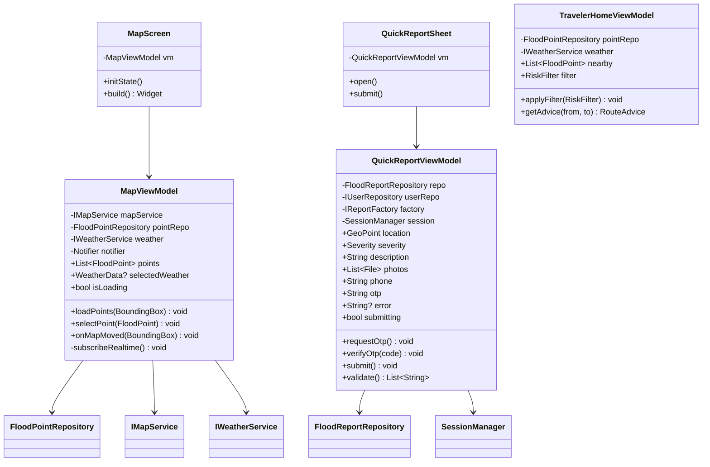
```mermaid
classDiagram
    direction TB

    class MapScreen {
        -MapViewModel vm
        +initState()
        +build() Widget
    }

    class QuickReportSheet {
        -QuickReportViewModel vm
        +open()
        +submit()
    }

    class MapViewModel {
        -IMapService mapService
        -FloodPointRepository pointRepo
        -IWeatherService weather
        -Notifier notifier
        +List~FloodPoint~ points
        +WeatherData? selectedWeather
        +bool isLoading
        +loadPoints(BoundingBox) void
        +selectPoint(FloodPoint) void
        +onMapMoved(BoundingBox) void
        -subscribeRealtime() void
    }

    class QuickReportViewModel {
        -FloodReportRepository repo
        -IUserRepository userRepo
        -IReportFactory factory
        -SessionManager session
        +GeoPoint location
        +Severity severity
        +String description
        +List~File~ photos
        +String phone
        +String otp
        +String? error
        +bool submitting
        +requestOtp() void
        +verifyOtp(code) void
        +submit() void
        +validate() List~String~
    }

    class TravelerHomeViewModel {
        -FloodPointRepository pointRepo
        -IWeatherService weather
        +List~FloodPoint~ nearby
        +RiskFilter filter
        +applyFilter(RiskFilter) void
        +getAdvice(from, to) RouteAdvice
    }

    MapScreen --> MapViewModel
    QuickReportSheet --> QuickReportViewModel
    QuickReportViewModel --> FloodReportRepository
    QuickReportViewModel --> SessionManager
    MapViewModel --> FloodPointRepository
    MapViewModel --> IMapService
    MapViewModel --> IWeatherService
```

### 2.4 Object Diagram — ตัวอย่าง runtime instance

> แสดงเป็น snapshot ของ instance จริง ณ เวลา 12:30 น. (เขตบางนา)

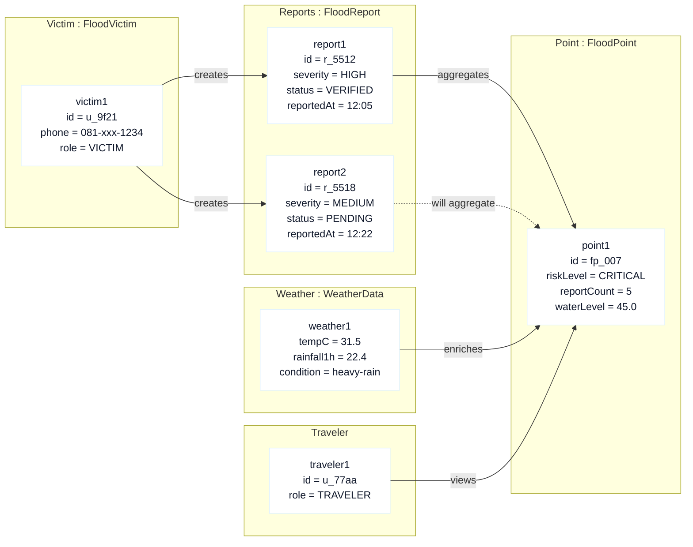
```mermaid
flowchart LR
    subgraph S1["Victim : FloodVictim"]
        victim1["victim1<br/>id = u_9f21<br/>phone = 081-xxx-1234<br/>role = VICTIM"]
    end
    subgraph S2["Reports : FloodReport"]
        report1["report1<br/>id = r_5512<br/>severity = HIGH<br/>status = VERIFIED<br/>reportedAt = 12:05"]
        report2["report2<br/>id = r_5518<br/>severity = MEDIUM<br/>status = PENDING<br/>reportedAt = 12:22"]
    end
    subgraph S3["Point : FloodPoint"]
        point1["point1<br/>id = fp_007<br/>riskLevel = CRITICAL<br/>reportCount = 5<br/>waterLevel = 45.0"]
    end
    subgraph S4["Weather : WeatherData"]
        weather1["weather1<br/>tempC = 31.5<br/>rainfall1h = 22.4<br/>condition = heavy-rain"]
    end
    subgraph S5["Traveler"]
        traveler1["traveler1<br/>id = u_77aa<br/>role = TRAVELER"]
    end

    victim1 -->|"creates"| report1
    victim1 -->|"creates"| report2
    report1 -->|"aggregates"| point1
    report2 -.->|"will aggregate"| point1
    weather1 -->|"enriches"| point1
    traveler1 -->|"views"| point1

    classDef ent fill:#FFFFFF,stroke:#E0F2FE,color:#0F172A
    class victim1,report1,report2,point1,weather1,traveler1 ent
```

---

## 3. Sequence Diagrams

### 3.1 Quick Report (Flow A) — ผู้ประสบอุทกภัย

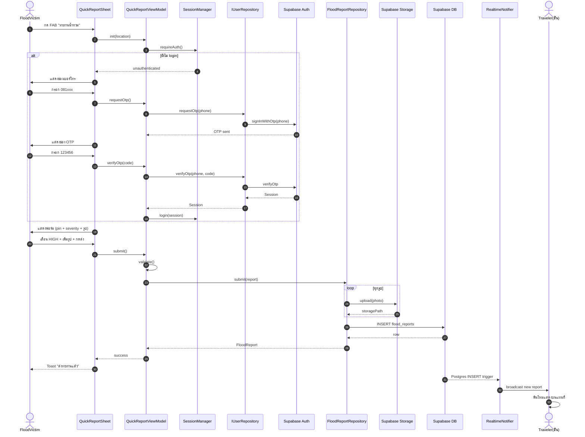
```mermaid
sequenceDiagram
    autonumber
    actor U as FloodVictim
    participant UI as QuickReportSheet
    participant VM as QuickReportViewModel
    participant SM as SessionManager
    participant UR as IUserRepository
    participant SB as Supabase Auth
    participant FR as FloodReportRepository
    participant ST as Supabase Storage
    participant DB as Supabase DB
    participant RT as RealtimeNotifier
    actor T as Traveler(อื่น)

    U->>UI: กด FAB "รายงานน้ำท่วม"
    UI->>VM: init(location)
    VM->>SM: requireAuth()
    alt ยังไม่ login
        SM-->>UI: unauthenticated
        UI->>U: แสดงช่องเบอร์โทร
        U->>UI: กรอก 081xxx
        UI->>VM: requestOtp()
        VM->>UR: requestOtp(phone)
        UR->>SB: signInWithOtp(phone)
        SB-->>VM: OTP sent
        UI->>U: แสดงช่อง OTP
        U->>UI: กรอก 123456
        UI->>VM: verifyOtp(code)
        VM->>UR: verifyOtp(phone, code)
        UR->>SB: verifyOtp
        SB-->>UR: Session
        UR-->>VM: Session
        VM->>SM: login(session)
    end

    UI->>U: แสดงฟอร์ม (pin + severity + รูป)
    U->>UI: เลือน HIGH + เพิ่มรูป + กดส่ง
    UI->>VM: submit()
    VM->>VM: validate()
    VM->>FR: submit(report)

    loop ทุกรูป
        FR->>ST: upload(photo)
        ST-->>FR: storagePath
    end

    FR->>DB: INSERT flood_reports
    DB-->>FR: row
    FR-->>VM: FloodReport
    VM-->>UI: success
    UI-->>U: Toast "ส่งรายงานแล้ว"

    DB-->>RT: Postgres INSERT trigger
    RT->>T: broadcast new report
    T->>T: พินใหม่แสดงบนแผนที่
```

### 3.2 เช็คจุดน้ำท่วม (Flow B) — ผู้เดินทาง

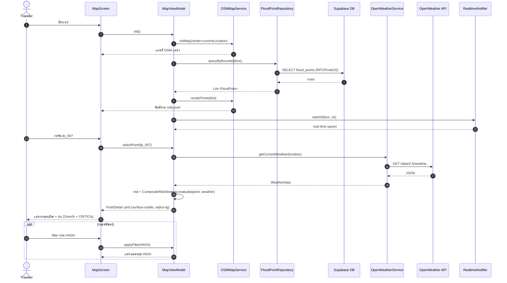
```mermaid
sequenceDiagram
    autonumber
    actor T as Traveler
    participant UI as MapScreen
    participant VM as MapViewModel
    participant MS as OSMMapService
    participant PR as FloodPointRepository
    participant DB as Supabase DB
    participant WS as OpenWeatherService
    participant OW as OpenWeather API
    participant RT as RealtimeNotifier

    T->>UI: เปิดแอป
    UI->>VM: init()
    VM->>MS: initMap(center=currentLocation)
    MS-->>UI: แผนที่ OSM แสดง

    VM->>PR: queryByBounds(bbox)
    PR->>DB: SELECT flood_points (RPC/PostGIS)
    DB-->>PR: rows
    PR-->>VM: List~FloodPoint~

    VM->>MS: renderPoints(list)
    MS-->>UI: พินสีตาม riskLevel

    VM->>RT: watch(bbox, cb)
    RT-->>VM: real-time upsert

    T->>UI: กดพิน fp_007
    UI->>VM: selectPoint(fp_007)
    VM->>WS: getCurrentWeather(location)
    WS->>OW: GET /data/2.5/weather
    OW-->>WS: JSON
    WS-->>VM: WeatherData

    VM->>VM: risk = CompositeRiskStrategy.evaluate(point, weather)
    VM-->>UI: PointDetail card (surface-subtle, radius-lg)
    UI-->>T: แสดงรายละเอียด + ฝน 22mm/h + CRITICAL

    opt กรอง/ค้นหา
        T->>UI: filter risk=HIGH
        UI->>VM: applyFilter(HIGH)
        VM-->>UI: แสดงเฉพาะจุด HIGH
    end
```

### 3.3 Admin Verify → Aggregate → Realtime Push

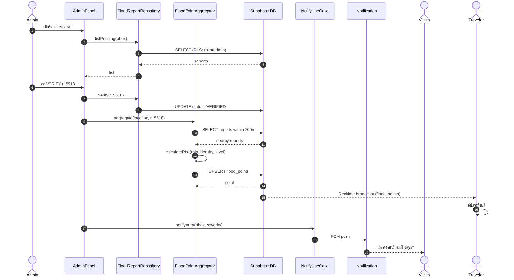
```mermaid
sequenceDiagram
    autonumber
    actor A as Admin
    participant UI as AdminPanel
    participant AR as FloodReportRepository
    participant AG as FloodPointAggregator
    participant DB as Supabase DB
    participant FN as NotifyUseCase
    participant N as Notification
    actor V as Victim
    actor T as Traveler

    A->>UI: เปิดคิว PENDING
    UI->>AR: listPending(bbox)
    AR->>DB: SELECT (RLS: role=admin)
    DB-->>AR: reports
    AR-->>UI: list

    A->>UI: กด VERIFY r_5518
    UI->>AR: verify(r_5518)
    AR->>DB: UPDATE status='VERIFIED'

    UI->>AG: aggregate(location, r_5518)
    AG->>DB: SELECT reports within 200m
    DB-->>AG: nearby reports
    AG->>AG: calculateRisk(rain, density, level)
    AG->>DB: UPSERT flood_points
    DB-->>AG: point

    DB-->>T: Realtime broadcast (flood_points)
    T->>T: อัปเดตพิน/สี

    UI->>FN: notifyArea(bbox, severity)
    FN->>N: FCM push
    N-->>V: "มีรายงานน้ำท่วมใกล้คุณ"
```

### 3.4 Offline Outbox (Network ขาด)

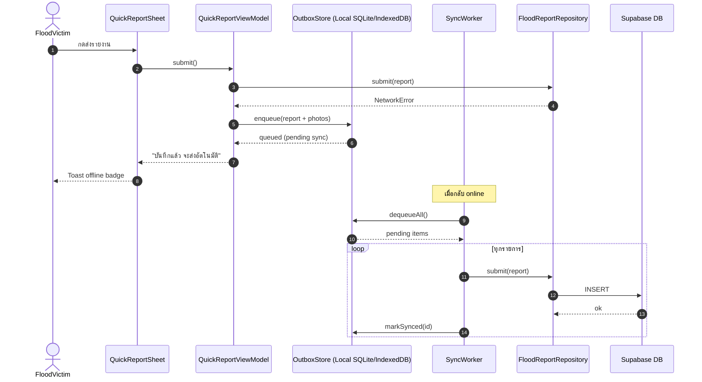
```mermaid
sequenceDiagram
    autonumber
    actor U as FloodVictim
    participant UI as QuickReportSheet
    participant VM as QuickReportViewModel
    participant OB as OutboxStore (Local SQLite/IndexedDB)
    participant BG as SyncWorker
    participant FR as FloodReportRepository
    participant DB as Supabase DB

    U->>UI: กดส่งรายงาน
    UI->>VM: submit()
    VM->>FR: submit(report)
    FR-->>VM: NetworkError
    VM->>OB: enqueue(report + photos)
    OB-->>VM: queued (pending sync)
    VM-->>UI: "บันทึกแล้ว จะส่งอัตโนมัติ"
    UI-->>U: Toast offline badge

    Note over BG: เมื่อกลับ online
    BG->>OB: dequeueAll()
    OB-->>BG: pending items
    loop ทุกรายการ
        BG->>FR: submit(report)
        FR->>DB: INSERT
        DB-->>FR: ok
        BG->>OB: markSynced(id)
    end
```

### 3.5 Route Advice (ผู้เดินทางขอคำแนะนำเส้นทาง)

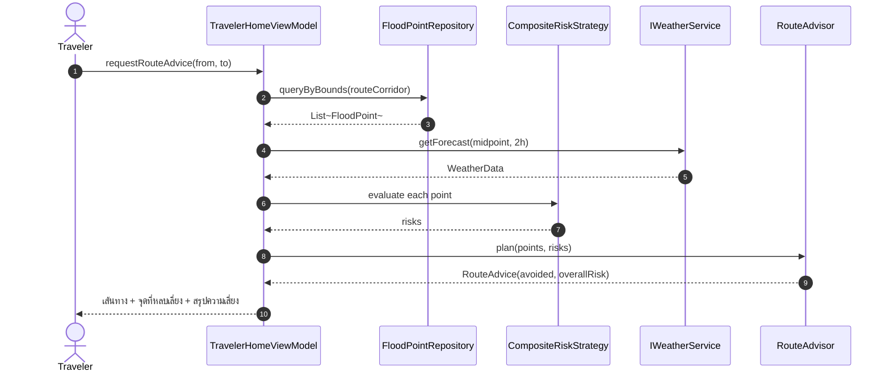
```mermaid
sequenceDiagram
    autonumber
    actor T as Traveler
    participant VM as TravelerHomeViewModel
    participant PR as FloodPointRepository
    participant RS as CompositeRiskStrategy
    participant WS as IWeatherService
    participant RA as RouteAdvisor

    T->>VM: requestRouteAdvice(from, to)
    VM->>PR: queryByBounds(routeCorridor)
    PR-->>VM: List~FloodPoint~
    VM->>WS: getForecast(midpoint, 2h)
    WS-->>VM: WeatherData
    VM->>RS: evaluate each point
    RS-->>VM: risks
    VM->>RA: plan(points, risks)
    RA-->>VM: RouteAdvice(avoided, overallRisk)
    VM-->>T: เส้นทาง + จุดที่หลบเลี่ยง + สรุปความเสี่ยง
```

---

## 4. Activity Diagrams

### 4.1 Quick Report Workflow

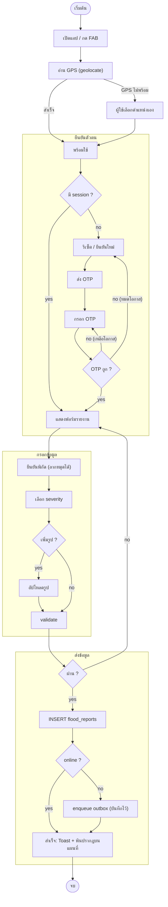
```mermaid
flowchart TD
    Start(["เริ่มต้น"]) --> A["เปิดแอป / กด FAB"]
    A --> B["อ่าน GPS (geolocate)"]
    B -->|"สำเร็จ"| C["พร้อมใช้"]
    B -->|"GPS ไม่พร้อม"| B2["ผู้ใช้เลือกตำแหน่งเอง"] --> C

    subgraph S1["ยืนยันตัวตน"]
        C --> D{"มี session ?"}
        D -->|"yes"| F["แสดงฟอร์มรายงาน"]
        D -->|"no"| E["กรอกเบอร์โทร"]
        E --> E2["ส่ง OTP"] --> E3["กรอก OTP"]
        E3 --> E4{"OTP ถูก ?"}
        E4 -->|"yes"| F
        E4 -->|"no (เหลือโอกาส)"| E3
        E4 -->|"no (หมดโอกาส)"| E["รีเซ็ต / ยืนยันใหม่"]
    end

    subgraph S2["กรอกข้อมูล"]
        F --> G["ยืนยันพิกัด (ลากหมุดได้)"] --> H["เลือก severity"] --> I{"เพิ่มรูป ?"}
        I -->|"yes"| J["อัปโหลดรูป"] --> K["validate"]
        I -->|"no"| K
    end

    subgraph S3["ส่งข้อมูล"]
        K --> L{"ผ่าน ?"}
        L -->|"no"| F
        L -->|"yes"| M["INSERT flood_reports"]
        M --> N{"online ?"}
        N -->|"yes"| O["สำเร็จ: Toast + พินปรากฏบนแผนที่"]
        N -->|"no"| P["enqueue outbox (บันทึกไว้)"] --> O
    end

    O --> End(["จบ"])
```

### 4.2 Traveler Check Flow

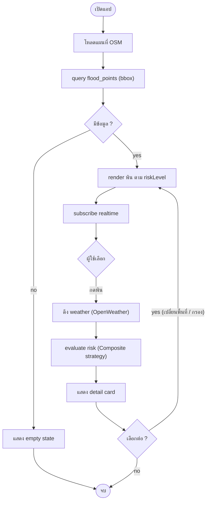
```mermaid
flowchart TD
    Start(["เปิดแอป"]) --> A["โหลดแผนที่ OSM"]
    A --> B["query flood_points (bbox)"]
    B --> C{"มีข้อมูล ?"}
    C -->|"no"| C2["แสดง empty state"] --> End(["จบ"])
    C -->|"yes"| D["render พิน ตาม riskLevel"]
    D --> E["subscribe realtime"]
    E --> F{"ผู้ใช้เลือก"}
    F -->|"กดพิน"| G["ดึง weather (OpenWeather)"]
    G --> H["evaluate risk (Composite strategy)"]
    H --> I["แสดง detail card"]
    I --> J{"เลือกต่อ ?"}
    J -->|"yes (เปลี่ยนพื้นที่ / กรอง)"| D
    J -->|"no"| End
```

### 4.3 Admin Verification Flow

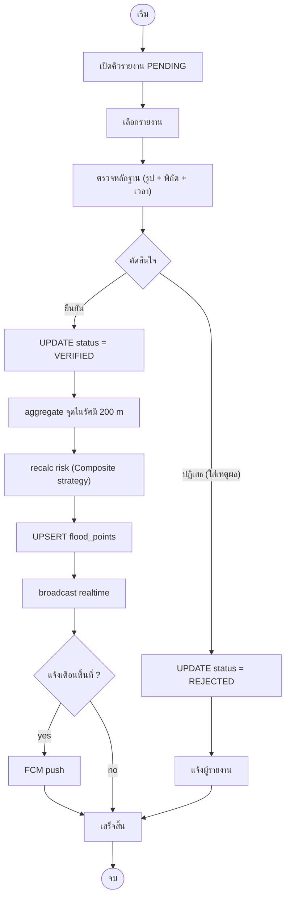
```mermaid
flowchart TD
    Start(["เริ่ม"]) --> A["เปิดคิวรายงาน PENDING"]
    A --> B["เลือกรายงาน"] --> C["ตรวจหลักฐาน (รูป + พิกัด + เวลา)"]
    C --> D{"ตัดสินใจ"}
    D -->|"ยืนยัน"| E["UPDATE status = VERIFIED"]
    E --> F["aggregate จุดในรัศมี 200 m"]
    F --> G["recalc risk (Composite strategy)"]
    G --> H["UPSERT flood_points"]
    H --> I["broadcast realtime"]
    I --> J{"แจ้งเตือนพื้นที่ ?"}
    J -->|"yes"| K["FCM push"] --> L["เสร็จสิ้น"]
    J -->|"no"| L
    D -->|"ปฏิเสธ (ใส่เหตุผล)"| M["UPDATE status = REJECTED"]
    M --> N["แจ้งผู้รายงาน"] --> L
    L --> End(["จบ"])
```

---

## 5. State Machine Diagrams

### 5.1 FloodReport lifecycle

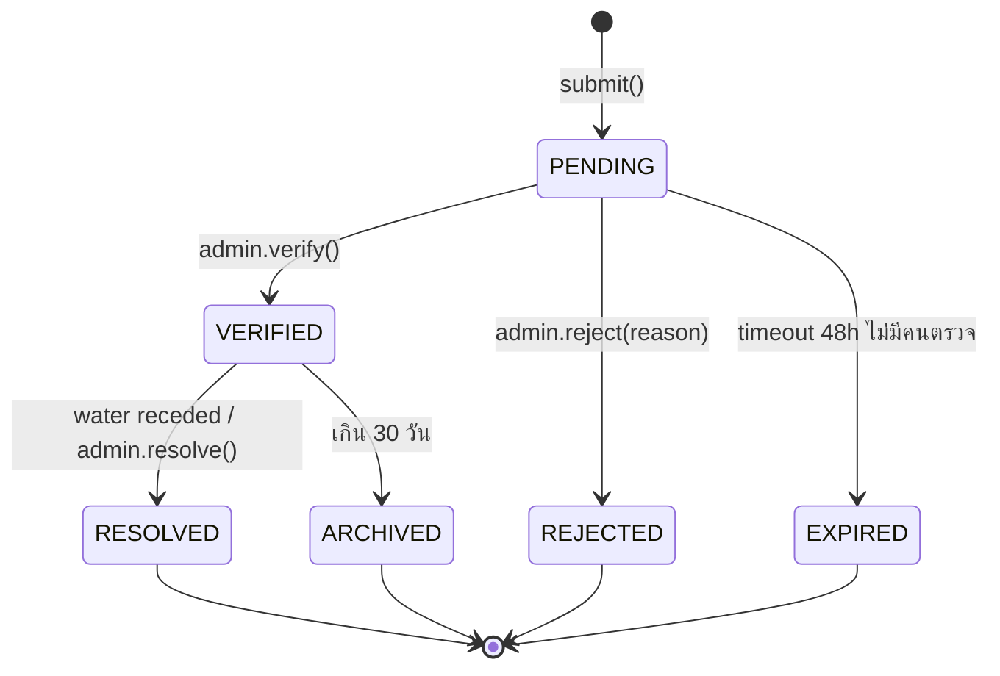
```mermaid
stateDiagram-v2
    [*] --> PENDING : submit()
    PENDING --> VERIFIED : admin.verify()
    PENDING --> REJECTED : admin.reject(reason)
    PENDING --> EXPIRED : timeout 48h ไม่มีคนตรวจ
    VERIFIED --> RESOLVED : water receded / admin.resolve()
    VERIFIED --> ARCHIVED : เกิน 30 วัน
    REJECTED --> [*]
    RESOLVED --> [*]
    EXPIRED --> [*]
    ARCHIVED --> [*]
```

### 5.2 FloodPoint lifecycle

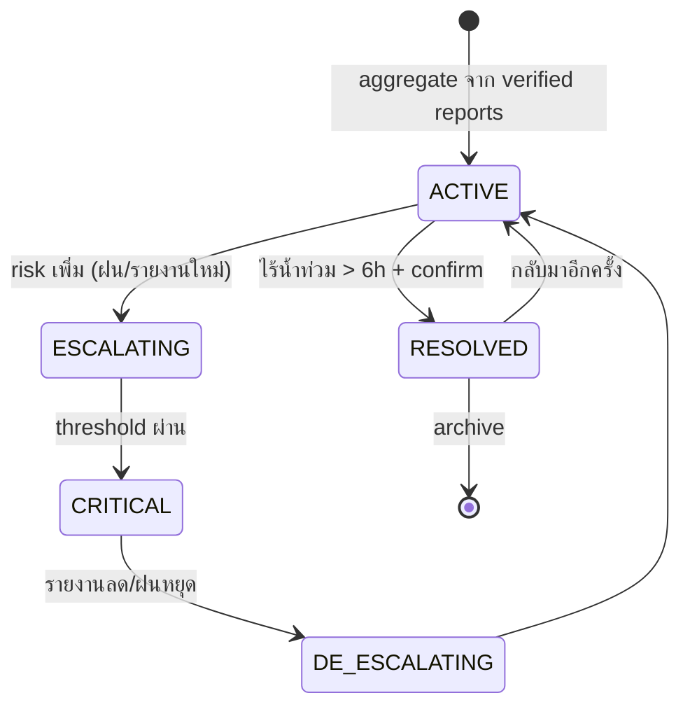
```mermaid
stateDiagram-v2
    [*] --> ACTIVE : aggregate จาก verified reports
    ACTIVE --> ESCALATING : risk เพิ่ม (ฝน/รายงานใหม่)
    ESCALATING --> CRITICAL : threshold ผ่าน
    CRITICAL --> DE_ESCALATING : รายงานลด/ฝนหยุด
    DE_ESCALATING --> ACTIVE
    ACTIVE --> RESOLVED : ไร้น้ำท่วม > 6h + confirm
    RESOLVED --> ACTIVE : กลับมาอีกครั้ง
    RESOLVED --> [*] : archive
```

### 5.3 Session / Auth state

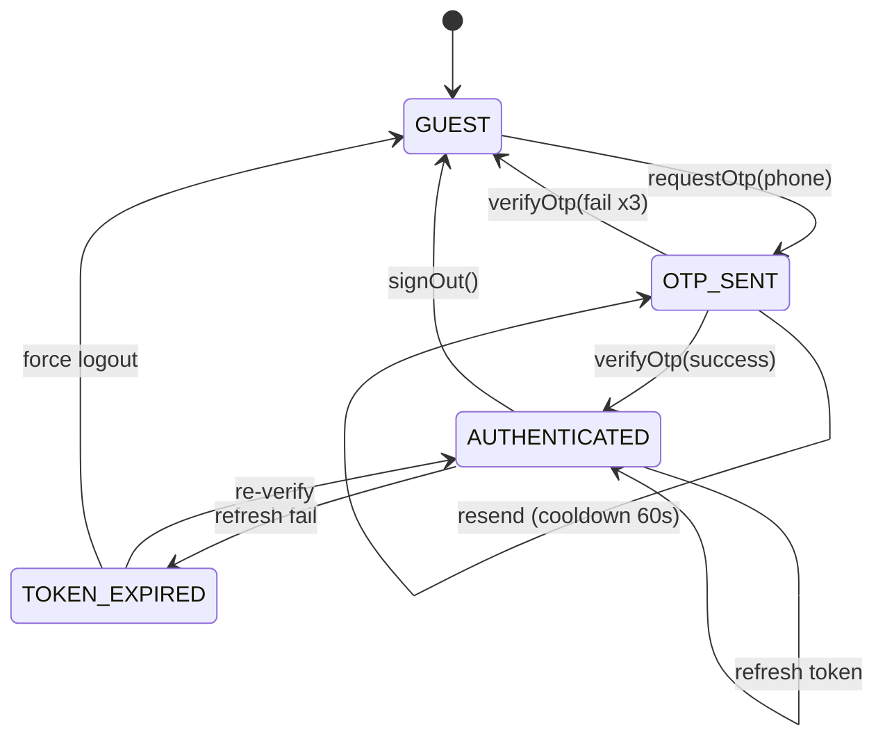
```mermaid
stateDiagram-v2
    [*] --> GUEST
    GUEST --> OTP_SENT : requestOtp(phone)
    OTP_SENT --> OTP_SENT : resend (cooldown 60s)
    OTP_SENT --> AUTHENTICATED : verifyOtp(success)
    OTP_SENT --> GUEST : verifyOtp(fail x3)
    AUTHENTICATED --> AUTHENTICATED : refresh token
    AUTHENTICATED --> GUEST : signOut()
    AUTHENTICATED --> TOKEN_EXPIRED : refresh fail
    TOKEN_EXPIRED --> AUTHENTICATED : re-verify
    TOKEN_EXPIRED --> GUEST : force logout
```

### 5.4 Report sync (Outbox)

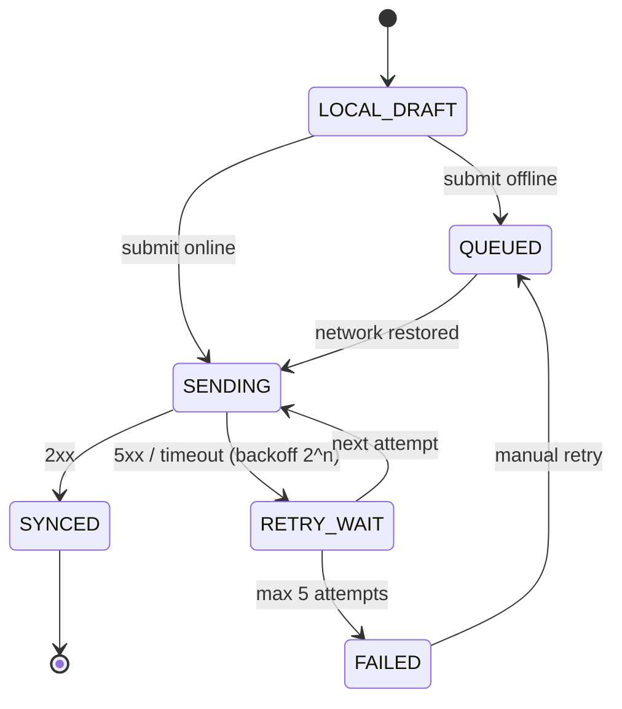
```mermaid
stateDiagram-v2
    [*] --> LOCAL_DRAFT
    LOCAL_DRAFT --> QUEUED : submit offline
    LOCAL_DRAFT --> SENDING : submit online
    QUEUED --> SENDING : network restored
    SENDING --> SYNCED : 2xx
    SENDING --> RETRY_WAIT : 5xx / timeout (backoff 2^n)
    RETRY_WAIT --> SENDING : next attempt
    RETRY_WAIT --> FAILED : max 5 attempts
    SYNCED --> [*]
    FAILED --> QUEUED : manual retry
```

---

## 6. Package & Component Architecture

### 6.1 Package Diagram (Layered + Ports/Adapters)

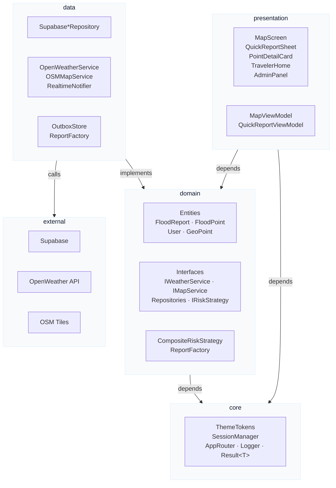
```mermaid
flowchart TB
    subgraph PRESENTATION["presentation"]
        direction LR
        P1["MapScreen<br/>QuickReportSheet<br/>PointDetailCard<br/>TravelerHome<br/>AdminPanel"]
        P2["MapViewModel<br/>QuickReportViewModel"]
    end

    subgraph DOMAIN["domain"]
        direction LR
        D1["Entities<br/>FloodReport · FloodPoint<br/>User · GeoPoint"]
        D2["Interfaces<br/>IWeatherService · IMapService<br/>Repositories · IRiskStrategy"]
        D3["CompositeRiskStrategy<br/>ReportFactory"]
    end

    subgraph DATA["data"]
        direction LR
        DA1["Supabase*Repository"]
        DA2["OpenWeatherService<br/>OSMMapService<br/>RealtimeNotifier"]
        DA3["OutboxStore<br/>ReportFactory"]
    end

    subgraph CORE["core"]
        direction LR
        C1["ThemeTokens<br/>SessionManager<br/>AppRouter · Logger · Result&lt;T&gt;"]
    end

    subgraph EXT["external"]
        direction LR
        E1["Supabase"]
        E2["OpenWeather API"]
        E3["OSM Tiles"]
    end

    PRESENTATION -->|"depends"| DOMAIN
    PRESENTATION -->|"depends"| CORE
    DATA -->|"implements"| DOMAIN
    DATA -->|"calls"| EXT
    DOMAIN -->|"depends"| CORE

    classDef pkg fill:#F8FAFC,stroke:#E0F2FE,color:#0F172A
    class PRESENTATION,DOMAIN,DATA,CORE,EXT pkg
```

> **Dependency Rule:** `presentation → domain ← data` — domain ไม่รู้จัก framework/SDK ใด ๆ

### 6.2 Component Diagram

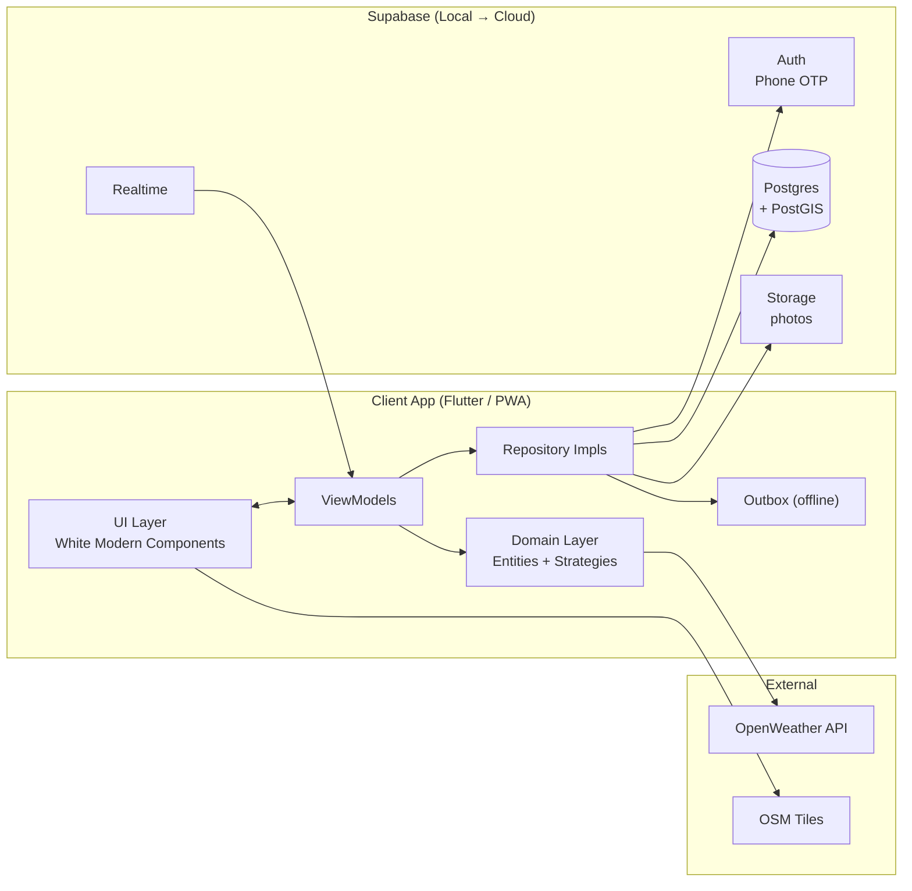
```mermaid
flowchart LR
    subgraph Client["Client App (Flutter / PWA)"]
        UI["UI Layer<br/>White Modern Components"]
        VM["ViewModels"]
        DOM["Domain Layer<br/>Entities + Strategies"]
        REP["Repository Impls"]
        OUT["Outbox (offline)"]
    end

    subgraph SB["Supabase (Local → Cloud)"]
        AUTH["Auth<br/>Phone OTP"]
        PG[("Postgres<br/>+ PostGIS")]
        RT["Realtime"]
        S3["Storage<br/>photos"]
    end

    subgraph Ext["External"]
        OW["OpenWeather API"]
        OSM["OSM Tiles"]
    end

    UI <--> VM
    VM --> DOM
    VM --> REP
    REP --> OUT
    REP --> AUTH
    REP --> PG
    REP --> S3
    RT --> VM
    DOM --> OW
    UI --> OSM
```

---

## 7. Data Model (Supabase Schema)

### 7.1 ER Diagram

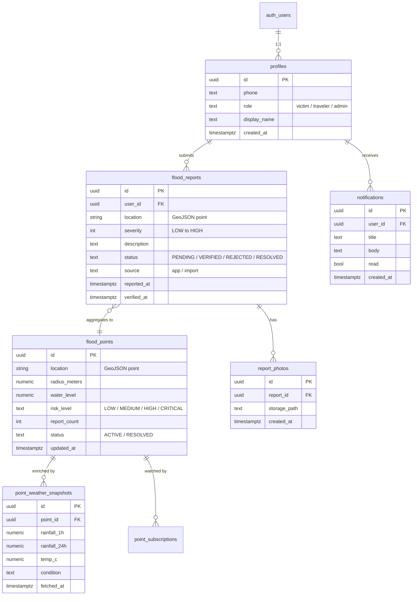
```mermaid
erDiagram
    auth_users ||--o{ profiles : "1:1"
    profiles ||--o{ flood_reports : "submits"
    flood_reports }o--|| flood_points : "aggregates to"
    flood_reports ||--o{ report_photos : "has"
    flood_points ||--o{ point_weather_snapshots : "enriched by"
    profiles ||--o{ notifications : "receives"
    flood_points ||--o{ point_subscriptions : "watched by"
    profiles {
        uuid id PK
        text phone
        text role "victim / traveler / admin"
        text display_name
        timestamptz created_at
    }
    flood_reports {
        uuid id PK
        uuid user_id FK
        string location "GeoJSON point"
        int severity "LOW to HIGH"
        text description
        text status "PENDING / VERIFIED / REJECTED / RESOLVED"
        text source "app / import"
        timestamptz reported_at
        timestamptz verified_at
    }
    report_photos {
        uuid id PK
        uuid report_id FK
        text storage_path
        timestamptz created_at
    }
    flood_points {
        uuid id PK
        string location "GeoJSON point"
        numeric radius_meters
        numeric water_level
        text risk_level "LOW / MEDIUM / HIGH / CRITICAL"
        int report_count
        text status "ACTIVE / RESOLVED"
        timestamptz updated_at
    }
    point_weather_snapshots {
        uuid id PK
        uuid point_id FK
        numeric rainfall_1h
        numeric rainfall_24h
        numeric temp_c
        text condition
        timestamptz fetched_at
    }
    notifications {
        uuid id PK
        uuid user_id FK
        text title
        text body
        bool read
        timestamptz created_at
    }
```

### 7.2 DDL (migration `0001_init.sql`)

```sql
create extension if not exists postgis;

create type user_role as enum ('victim', 'traveler', 'admin');
create type report_status as enum ('PENDING','VERIFIED','REJECTED','RESOLVED');
create type risk_level as enum ('LOW','MEDIUM','HIGH','CRITICAL');
create type point_status as enum ('ACTIVE','ESCALATING','CRITICAL','RESOLVED');

-- profiles
create table profiles (
  id uuid primary key references auth.users(id) on delete cascade,
  phone text unique not null,
  role user_role not null default 'victim',
  display_name text,
  created_at timestamptz not null default now()
);

-- flood_reports
create table flood_reports (
  id uuid primary key default gen_random_uuid(),
  user_id uuid not null references profiles(id) on delete cascade,
  location geography(point, 4326) not null,
  severity smallint not null check (severity between 1 and 3),
  description text,
  status report_status not null default 'PENDING',
  source text not null default 'app',
  reported_at timestamptz not null default now(),
  verified_at timestamptz,
  reject_reason text
);
create index flood_reports_geo_idx on flood_reports using gist (location);
create index flood_reports_status_idx on flood_reports (status, reported_at desc);

-- report_photos
create table report_photos (
  id uuid primary key default gen_random_uuid(),
  report_id uuid not null references flood_reports(id) on delete cascade,
  storage_path text not null,
  created_at timestamptz not null default now()
);

-- flood_points
create table flood_points (
  id uuid primary key default gen_random_uuid(),
  location geography(point, 4326) not null,
  radius_meters numeric not null default 200,
  water_level numeric,
  risk_level risk_level not null default 'MEDIUM',
  status point_status not null default 'ACTIVE',
  report_count int not null default 0,
  updated_at timestamptz not null default now()
);
create index flood_points_geo_idx on flood_points using gist (location);

-- weather snapshot
create table point_weather_snapshots (
  id uuid primary key default gen_random_uuid(),
  point_id uuid references flood_points(id) on delete cascade,
  rainfall_1h numeric, rainfall_24h numeric,
  temp_c numeric, condition text,
  fetched_at timestamptz not null default now()
);

-- RPC: ค้นจุดใน bounding box (ใช้โดยแอป)
create or replace function flood_points_in_bbox(min_lat float, min_lng float, max_lat float, max_lng float)
returns setof flood_points as $$
  select * from flood_points
  where location && ST_MakeEnvelope(min_lng, min_lat, max_lng, max_lat, 4326)
  and status <> 'RESOLVED';
$$ language sql stable;

-- RPC: aggregate verified reports -> flood point
create or replace function aggregate_reports_into_point(report_id uuid)
returns uuid as $$
  ... -- คำนวณ centroid ของ verified reports ในรัศมี 200m + upsert
$$ language plpgsql;

-- Realtime
alter publication supabase_realtime add table flood_points, flood_reports;

-- RLS
alter table profiles enable row level security;
alter table flood_reports enable row level security;
alter table flood_points enable row level security;
alter table report_photos enable row level security;

create policy "own profile" on profiles for all using (auth.uid() = id);
create policy "victim insert own report" on flood_reports
  for insert with check (auth.uid() = user_id);
create policy "anyone read reports" on flood_reports for select using (true);
create policy "admin update report" on flood_reports
  for update using (exists (select 1 from profiles where id = auth.uid() and role = 'admin'));
create policy "public read points" on flood_points for select using (true);
create policy "service write points" on flood_points for insert with check (true);
```

### 7.3 Supabase Local Workflow

```bash
supabase init
supabase start                 # docker: db + auth + realtime + storage + studio
supabase db reset              # apply migrations/ locally
supabase functions serve       # edge functions (weather proxy, aggregator)
# พัฒนาเสร็จ → deploy cloud
supabase link --project-ref <ref>
supabase db push
supabase functions deploy
```

> **เหตุผลที่ใช้ Local ก่อน:** ทำงาน offline, ทดสอบ RLS/migration ได้จริง, แล้ว `db push` ขึ้น Cloud โดยไม่ต้องแก้โค้ด (Repository pattern สลับ endpoint ผ่าน env)

---

## 8. Design Patterns Catalog

| # | Pattern | ประเภท | ใช้ที่ | เหตุผล |
|---|---|---|---|---|
| 1 | **Adapter** | Structural | `OpenWeatherService`, `OSMMapService` | ห่อ SDK/HTTP ภายนอก ให้ domain ไม่ผูก library |
| 2 | **Repository** | Architectural | `FloodReportRepository`, `FloodPointRepository` | แยก data access, สลับ Local/Cloud ได้ |
| 3 | **Dependency Inversion** | Architectural | `IWeatherService`, `IRiskStrategy` | domain กำหนด interface, infra implement |
| 4 | **Observer / Publisher-Subscriber** | Behavioral | Supabase Realtime → `MapViewModel` | จุดน้ำท่วมอัปเดตสดหลาย client |
| 5 | **Strategy** | Behavioral | `IRiskStrategy` (rain/density/water) | เปลี่ยนสูตรประเมินความเสี่ยงโดยไม่แตะโค้ดหลัก |
| 6 | **Composite (of Strategies)** | Structural | `CompositeRiskStrategy` + weights | รวมหลายเกณฑ์ถ่วงน้ำหนัก |
| 7 | **Factory** | Creational | `IReportFactory` | สร้าง `FloodReport` พร้อมค่า default/validate |
| 8 | **Singleton** | Creational | `SessionManager`, Supabase client | entry point เดียวของ session |
| 9 | **State** | Behavioral | Report/Point lifecycle (บท 5) | เปลี่ยนพฤติกรรมตามสถานะ |
| 10 | **Proxy / Cache-aside** | Structural | `ResponseCache` ใน weather service | ลดการเรียก API, ทน rate-limit |
| 11 | **Null Object** | Behavioral | `EmptyWeatherService` (offline) | แทน null ด้วย object ที่ทำอะไรได้ปลอดภัย |
| 12 | **MVVM** | Architectural (UI) | `MapScreen ↔ MapViewModel` | แยก UI กับ state, test ได้ |
| 13 | **Outbox / Retry with Backoff** | Integration | `OutboxStore + SyncWorker` | รายงานไม่หายเมื่อเน็ตหลุด |
| 14 | **Result\<T\> / Error Object** | Idiomatic | `core/Result` | จัดการ error แบบชัดเจน ไม่ throw ข้ามชั้น |

---

## 9. Module Breakdown & Class Inventory

### 9.1 Module Tree

```
src/
├─ core/
│  ├─ theme/            ThemeTokens, Radius, Surfaces, Colors
│  ├─ network/          HttpClient, Result<T>, ApiError
│  ├─ session/          SessionManager, AuthGuard
│  ├─ outbox/           OutboxStore, SyncWorker
│  └─ utils/            GeoUtils, DateTimeUtils, Logger
│
├─ domain/
│  ├─ entities/         User, FloodVictim, Traveler, Admin,
│  │                    FloodReport, FloodPoint, Media, Notification
│  ├─ valueobjects/     GeoPoint, BoundingBox, WeatherData, RouteAdvice
│  ├─ enums/            Role, Severity, ReportStatus, RiskLevel
│  ├─ interfaces/       IWeatherService, IMapService, Notifier,
│  │                    repositories, IReportFactory, IRiskStrategy
│  ├─ strategies/       CompositeRiskStrategy, RainfallRiskStrategy,
│  │                    ReportDensityStrategy, WaterLevelStrategy
│  └─ usecases/         SubmitReportUseCase, CheckFloodPointsUseCase,
│                       VerifyReportUseCase, GetWeatherUseCase,
│                       RequestRouteAdviceUseCase, WatchUpdatesUseCase
│
├─ data/
│  ├─ repositories/     SupabaseFloodReportRepository,
│  │                    SupabaseFloodPointRepository, SupabaseUserRepository
│  ├─ services/         OpenWeatherService, OSMMapService, RealtimeNotifier
│  ├─ mappers/          ReportMapper, PointMapper, WeatherMapper
│  └─ local/            LocalCache, OutboxDatabase
│
├─ presentation/
│  ├─ screens/          MapScreen, QuickReportScreen, PointDetailScreen,
│  │                    TravelerHomeScreen, AdminQueueScreen, AuthScreen
│  ├─ viewmodels/       MapViewModel, QuickReportViewModel,
│  │                    TravelerHomeViewModel, AdminViewModel
│  └─ widgets/          BrandLogo, FABReport, PointPin, SeverityChip,
│                       RiskBadge, BottomSheetCard, EmptyState, Toast
│
└─ app/                 AppRoot, Router, DI container
```

### 9.2 Class Inventory (นับ)

| Layer | classes/interfaces | ประมาณ |
|---|---|---|
| core | ~12 | |
| domain (entities+VO+enums+interfaces+strategies+usecases) | ~34 | |
| data | ~14 | |
| presentation (screens+VM+widgets) | ~24 | |
| **รวม** | **~84** | |

### 9.3 Key Sequence: การสร้าง object (DI)

```
AppRoot
 ├─ new SupabaseClient(env)              → singleton
 ├─ new SessionManager(client)           → singleton
 ├─ new OpenWeatherService(apiKey, cache)
 ├─ new OSMMapService()
 ├─ new SupabaseFloodReportRepository(client, session)
 ├─ new SupabaseFloodPointRepository(client)
 ├─ new CompositeRiskStrategy([rain 0.5, density 0.3, level 0.2])
 ├─ new ReportFactory(clock)
 └─ new RealtimeNotifier(client)
       ↓ inject
     ViewModels (constructor injection)
```

---

## 10. Deployment Diagram

```mermaid
flowchart TB
    subgraph Device["อุปกรณ์ผู้ใช้"]
        APP["ROiCORE App<br/>(Flutter / PWA)"]
        CACHE["Local Cache + Outbox"]
    end

    subgraph Edge["Edge / CDN"]
        TILE["OSM Tile Server<br/>(tile.openstreetmap.org / local mirror)"]
    end

    subgraph Cloud["Cloud"]
        subgraph SBX["Supabase Project"]
            AU["Auth (Phone OTP)"]
            PGX[("Postgres + PostGIS")]
            RTX["Realtime"]
            STX["Storage (photos)"]
            FX["Edge Functions<br/>aggregator / weather-proxy"]
        end
        OWX["OpenWeather API"]
        FCMX["FCM Push"]
    end

    APP --> TILE
    APP --> AU
    APP --> PGX
    APP --> STX
    APP <--> RTX
    APP --> CACHE
    CACHE -- sync when online --> PGX
    FX --> OWX
    FX --> PGX
    RTX --> FCMX
```

---

## 11. Non-Functional Requirements (เต็ม)

| ID | หมวด | ข้อกำหนด | วิธีวัด/วิธีทำ |
|---|---|---|---|
| NFR-01 | Performance | เปิดแผนที่ครั้งแรก < 2s, submit report < 3s | tile cache, index GiST, upsert RPC |
| NFR-02 | Performance | query จุดใน bbox < 300ms (10k points) | PostGIS GiST index + `flood_points_in_bbox` |
| NFR-03 | Availability | 99.5% uptime | Supabase health, client retry + outbox |
| NFR-04 | Reliability | รายงานไม่สูญหายแม้ offline | Outbox + retry backoff (max 5) |
| NFR-05 | Security | Auth ทุก write ด้วย OTP | Supabase Auth, RLS ทุกตาราง |
| NFR-06 | Security | ข้อมูล location เป็นของผู้ใช้ | RLS policy per-user + anonymize เกิน 90 วัน |
| NFR-07 | Security | API key weather ไม่รั่ว | edge function proxy ฝั่ง server |
| NFR-08 | Scalability | รองรับ 1,000 concurrent | pgBouncer (Supabase), realtime channels ต่อ bbox |
| NFR-09 | Usability | Quick Report ≤ 3 taps | design review + tap-count test |
| NFR-10 | Usability | White Modern — **ไม่มีเส้นขอบ** | UI lint: ห้ามมี `border`/`divider` |
| NFR-11 | Usability | Radius คงที่ตาม token | design token enforce ใน component library |
| NFR-12 | i18n | ไทย/อังกฤษ | ARB / i18n files |
| NFR-13 | Accessibility | contrast ≥ 4.5:1, tap target ≥ 44px | a11y test |
| NFR-14 | Maintainability | domain ทดสอบ unit ได้โดยไม่ต้องเปิด app | test ครอบ domain + strategies |
| NFR-15 | Observability | log error + performance | structured logger, Supabase logs |

---

## 12. Testing Strategy

| ชั้น | เครื่องมือ | ครอบคลุม |
|---|---|---|
| Unit (domain) | Dart test / Vitest | strategies, entities, usecases, mappers |
| Unit (data) | mock client | repository mapping + error path |
| Widget/Component | flutter_test / Testing Library | White UI, radius token, no-border lint |
| Integration | integration_test + supabase local | Flow A end-to-end (OTP→submit→realtime) |
| Contract | PostgREST schema check | migration drift |

**Test cases สำคัญ:**
- `CompositeRiskStrategy` — rain heavy + 3 reports → CRITICAL
- `ReportFactory` — severity validation, defaults
- Outbox — offline submit → online sync → ไม่ duplicate (idempotency key)
- RLS — victim อ่านได้ทุกจุด แต่เขียนได้เฉพาะของตัวเอง
- UI lint — ทุก component ไม่มี `border` property

---

## 13. Milestones & Definition of Done

| # | Phase | Deliverable | OOAD Artifact |
|---|---|---|---|
| M0 | Setup | Supabase local + repo + design tokens | — |
| M1 | Analysis | Requirements + Use Case เสร็จ | §0–§1 |
| M2 | Design | Class/Sequence/State เสร็จ | §2–§5 |
| M3 | UI Kit | White Modern component set + brand `RO`**`i`**`CORE` | §6, NFR-10/11 |
| M4 | Flow B | แผนที่ OSM + พิน + weather (guest) | UC-01 |
| M5 | Flow A | Quick Report + OTP + photo + realtime | UC-02, §3.1 |
| M6 | Intelligence | Risk strategies + route advice | §2.2, §3.5 |
| M7 | Admin | Verify queue + aggregator + push | UC-09..11 |
| M8 | Deploy | Supabase Cloud + CI + monitoring | §10 |

### Definition of Done (ต่อ feature)
- [ ] มี use case / class / sequence ระบุในเอกสารนี้
- [ ] domain ไม่ import SDK ภายนอก (ผ่าน interface เท่านั้น)
- [ ] repository มี RLS policy กำกับ
- [ ] ผ่าน UI & Content rule: ไม่มีเส้นขอบ · ห้ามใช้ shadow · ห้ามใช้ badge สิ้นเปลือง · ใช้ภาษาไทยเป็นหลัก · ห้ามมีศัพท์เทคนิคบนหน้าเว็บ · ห้ามมีวงเล็บภาษาอังกฤษ · ใช้ surface contrast & radius ตรง token
- [ ] มี unit test ครอบ logic หลัก
- [ ] Flow A ≤ 3 taps · Flow B ไม่ต้อง login
- [ ] ทดสอบบน Supabase Local แล้ว deploy Cloud ได้โดยไม่แก้โค้ด

---

*เอกสารนี้เป็น living document — อัปเดตทุกครั้งเมื่อ domain model เปลี่ยน*
